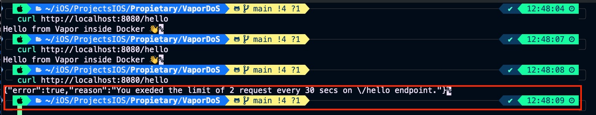

# VaporDoS

Sample app that shows how implement an DoS (Denial of Service) defense for a service implemented with 💧 Vapor. This is the basecode for following post [Stopping DoS Attacks: Vapor + Redis](https://javios.eu/vapor/stopping-dos-attacks-vapor-redis//)

## Review

## Requirements

- **Xcode 15.0 or later**
- **iOS 16.0 or later**

## 🔖 License

This project is licensed under the MIT License.  
See the [LICENSE](./LICENSE) file for details.

